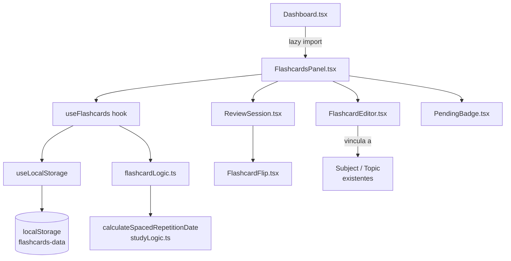
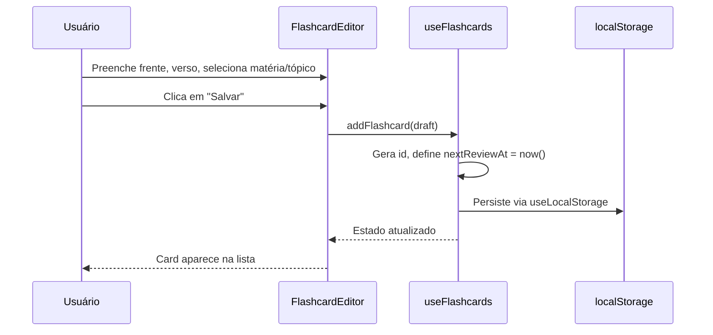
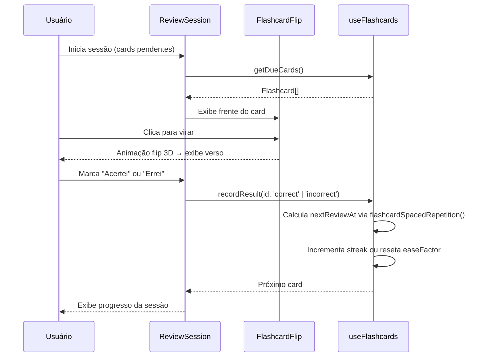

# Design Document: Flashcards

## Overview

O módulo de Flashcards adiciona ao Foco ENEM um sistema de estudo ativo baseado em repetição espaçada adaptativa. O aluno cria cards (frente = pergunta, verso = resposta) vinculados a matérias e tópicos existentes, realiza sessões de revisão com animação de flip 3D e recebe agendamento automático de próximas revisões com base no desempenho (acerto/erro), integrando-se ao algoritmo `calculateSpacedRepetitionDate` já presente em `studyLogic.ts`.

O módulo persiste todos os dados via `useLocalStorage` sob a chave `flashcards-data`, segue a estética Glassmorphism/Neon do projeto e se integra ao `Dashboard.tsx` como uma nova seção lazy-loaded.

---

## Architecture



---

## Sequence Diagrams

### Criar um Flashcard



### Sessão de Revisão



---

## Components and Interfaces

### FlashcardsPanel.tsx

**Purpose**: Ponto de entrada do módulo; exibe lista de cards, botão de nova sessão e editor.

**Interface**:
```typescript
interface FlashcardsPanelProps {
  subjects: Subject[]
}
```

**Responsibilities**:
- Renderizar contador de cards pendentes (`PendingBadge`)
- Alternar entre visualização de lista, editor e sessão de revisão
- Lazy-loaded no `Dashboard.tsx` via `React.lazy`

---

### FlashcardEditor.tsx

**Purpose**: Formulário para criar e editar flashcards.

**Interface**:
```typescript
interface FlashcardEditorProps {
  subjects: Subject[]
  initialCard?: Flashcard
  onSave: (draft: FlashcardDraft) => void
  onCancel: () => void
}
```

**Responsibilities**:
- Campos: frente (pergunta), verso (resposta), matéria, tópico (opcional)
- Validação: frente e verso não podem ser vazios
- Suporte a edição de card existente

---

### ReviewSession.tsx

**Purpose**: Conduz a sessão de revisão dos cards pendentes.

**Interface**:
```typescript
interface ReviewSessionProps {
  cards: Flashcard[]
  onResult: (id: string, result: ReviewResult) => void
  onFinish: () => void
}
```

**Responsibilities**:
- Iterar sobre cards pendentes em ordem de urgência (`nextReviewAt` mais antigo primeiro)
- Exibir progresso (ex: "3 / 10")
- Chamar `onResult` com `'correct'` ou `'incorrect'`
- Exibir tela de conclusão ao terminar

---

### FlashcardFlip.tsx

**Purpose**: Card individual com animação de flip 3D.

**Interface**:
```typescript
interface FlashcardFlipProps {
  front: string
  back: string
  isFlipped: boolean
  onFlip: () => void
  subjectColor: string
}
```

**Responsibilities**:
- Animação CSS 3D via Framer Motion (`rotateY: 0 → 180`)
- Exibir frente quando `isFlipped = false`, verso quando `true`
- Aplicar cor da matéria como borda/glow neon

---

### PendingBadge.tsx

**Purpose**: Contador visual de cards pendentes de revisão.

**Interface**:
```typescript
interface PendingBadgeProps {
  count: number
}
```

**Responsibilities**:
- Exibir número de cards com `nextReviewAt <= now()`
- Pulsar com animação quando `count > 0`
- Retornar `null` quando `count === 0`

---

## Data Models

### Flashcard

```typescript
interface Flashcard {
  id: string                    // UUID gerado no cliente
  front: string                 // Pergunta (frente do card)
  back: string                  // Resposta (verso do card)
  subjectId: string             // Referência à Subject existente
  topicId?: string              // Referência ao Topic (opcional)
  createdAt: string             // ISO date string
  nextReviewAt: string          // ISO date string — próxima revisão agendada
  easeFactor: number            // Fator de facilidade SM-2 (padrão: 2.5)
  interval: number              // Intervalo atual em dias
  repetitions: number           // Número de revisões bem-sucedidas consecutivas
  lastResult?: ReviewResult     // Último resultado registrado
  lastReviewedAt?: string       // ISO date string da última revisão
}
```

**Validation Rules**:
- `front` e `back`: strings não-vazias, máximo 500 caracteres cada
- `subjectId`: deve referenciar uma `Subject` existente
- `easeFactor`: clamp entre 1.3 e 2.5
- `interval`: mínimo 1 dia
- `repetitions`: inteiro não-negativo

---

### FlashcardDraft

```typescript
type FlashcardDraft = Pick<Flashcard, 'front' | 'back' | 'subjectId'> & {
  topicId?: string
}
```

---

### ReviewResult

```typescript
type ReviewResult = 'correct' | 'incorrect'
```

---

### FlashcardsState

```typescript
interface FlashcardsState {
  cards: Flashcard[]
}
```

Persistido no `localStorage` sob a chave `flashcards-data`.

---

## Algorithmic Pseudocode

### Algoritmo de Repetição Espaçada para Flashcards (SM-2 Simplificado)

```typescript
// flashcardLogic.ts

/**
 * Calcula o próximo estado de um flashcard após uma revisão.
 * Baseado no algoritmo SM-2 simplificado.
 *
 * Preconditions:
 *   - card.easeFactor >= 1.3
 *   - card.interval >= 1
 *   - card.repetitions >= 0
 *   - result é 'correct' ou 'incorrect'
 *
 * Postconditions:
 *   - Se result === 'incorrect': repetitions = 0, interval = 1, easeFactor reduz 0.2 (min 1.3)
 *   - Se result === 'correct' e repetitions === 0: interval = 1
 *   - Se result === 'correct' e repetitions === 1: interval = 6
 *   - Se result === 'correct' e repetitions > 1: interval = round(interval * easeFactor)
 *   - easeFactor aumenta 0.1 por acerto (max 2.5)
 *   - nextReviewAt = now + interval dias
 */
function computeNextReview(card: Flashcard, result: ReviewResult): Partial<Flashcard> {
  const now = new Date().toISOString()

  if (result === 'incorrect') {
    const newEase = Math.max(1.3, card.easeFactor - 0.2)
    const nextDate = addDays(new Date(), 1).toISOString()
    return {
      repetitions: 0,
      interval: 1,
      easeFactor: newEase,
      lastResult: 'incorrect',
      lastReviewedAt: now,
      nextReviewAt: nextDate,
    }
  }

  // result === 'correct'
  let newInterval: number
  if (card.repetitions === 0) {
    newInterval = 1
  } else if (card.repetitions === 1) {
    newInterval = 6
  } else {
    newInterval = Math.round(card.interval * card.easeFactor)
  }

  const newEase = Math.min(2.5, card.easeFactor + 0.1)
  const nextDate = addDays(new Date(), newInterval).toISOString()

  return {
    repetitions: card.repetitions + 1,
    interval: newInterval,
    easeFactor: newEase,
    lastResult: 'correct',
    lastReviewedAt: now,
    nextReviewAt: nextDate,
  }
}

/**
 * Retorna os cards pendentes de revisão (nextReviewAt <= agora),
 * ordenados do mais urgente para o menos urgente.
 *
 * Preconditions:
 *   - cards é um array válido (pode ser vazio)
 *
 * Postconditions:
 *   - Retorna subconjunto de cards onde nextReviewAt <= now
 *   - Ordenado por nextReviewAt ASC (mais atrasado primeiro)
 */
function getDueCards(cards: Flashcard[]): Flashcard[] {
  const now = new Date()
  return cards
    .filter(c => new Date(c.nextReviewAt) <= now)
    .sort((a, b) => new Date(a.nextReviewAt).getTime() - new Date(b.nextReviewAt).getTime())
}
```

---

## Key Functions with Formal Specifications

### `addFlashcard(draft: FlashcardDraft): void`

**Preconditions:**
- `draft.front.trim().length > 0`
- `draft.back.trim().length > 0`
- `draft.subjectId` referencia uma `Subject` existente

**Postconditions:**
- Um novo `Flashcard` é adicionado ao estado com `id` único
- `nextReviewAt` é definido como `new Date().toISOString()` (disponível imediatamente)
- `easeFactor = 2.5`, `interval = 1`, `repetitions = 0`
- Estado é persistido via `useLocalStorage`

---

### `recordResult(id: string, result: ReviewResult): void`

**Preconditions:**
- `id` corresponde a um `Flashcard` existente no estado
- `result` é `'correct'` ou `'incorrect'`

**Postconditions:**
- O `Flashcard` com o `id` fornecido tem seus campos atualizados via `computeNextReview`
- `lastReviewedAt` é definido como `now`
- `nextReviewAt` é recalculado com base no novo `interval`
- Estado é persistido via `useLocalStorage`

---

### `deleteFlashcard(id: string): void`

**Preconditions:**
- `id` é uma string não-vazia

**Postconditions:**
- O card com o `id` fornecido é removido do estado (se existir)
- Se não existir, o estado permanece inalterado (operação idempotente)

---

### `getDueCount(cards: Flashcard[]): number`

**Preconditions:**
- `cards` é um array válido

**Postconditions:**
- Retorna o número de cards onde `new Date(c.nextReviewAt) <= new Date()`
- Retorna `0` se nenhum card estiver pendente

---

## Example Usage

```typescript
// Inicializar o hook
const { cards, addFlashcard, recordResult, deleteFlashcard, dueCards } = useFlashcards()

// Criar um novo flashcard
addFlashcard({
  front: 'O que é mitose?',
  back: 'Divisão celular que gera duas células-filhas geneticamente idênticas.',
  subjectId: 'bio-001',
  topicId: 'topic-celulas',
})

// Iniciar sessão de revisão
const pending = dueCards // Flashcard[] ordenados por urgência

// Registrar resultado após o aluno virar o card
recordResult(pending[0].id, 'correct')
// → interval aumenta, nextReviewAt avança vários dias

recordResult(pending[1].id, 'incorrect')
// → interval volta a 1 dia, easeFactor reduz

// Contador de pendentes para o badge
const count = dueCards.length // exibido no PendingBadge
```

---

## Correctness Properties

*A property is a characteristic or behavior that should hold true across all valid executions of a system — essentially, a formal statement about what the system should do. Properties serve as the bridge between human-readable specifications and machine-verifiable correctness guarantees.*

### Property 1: Criação de flashcard aumenta a lista em exatamente 1

*For any* FlashcardsState and any valid FlashcardDraft (front e back não-vazios, subjectId válido), chamar `addFlashcard(draft)` deve resultar em `cards.length === before + 1`.

**Validates: Requirements 1.1**

---

### Property 2: Campos inválidos rejeitam a criação sem alterar o estado

*For any* FlashcardDraft onde `front.trim() === ''` ou `back.trim() === ''` (incluindo strings compostas apenas de espaços em branco), `addFlashcard` deve rejeitar a operação e o `cards.length` deve permanecer inalterado.

**Validates: Requirements 1.2, 1.6**

---

### Property 3: Flashcard criado tem estado inicial correto

*For any* FlashcardDraft válido, o Flashcard criado deve ter `easeFactor === 2.5`, `interval === 1`, `repetitions === 0` e `new Date(nextReviewAt) <= new Date()`.

**Validates: Requirements 1.3, 1.4**

---

### Property 4: Acerto nunca reduz o intervalo (para repetitions > 1)

*For any* Flashcard com `repetitions > 1`, após registrar `'correct'`, o novo `interval` deve ser `>= card.interval`.

**Validates: Requirements 2.1**

---

### Property 5: Erro sempre reseta repetitions para 0 e interval para 1

*For any* Flashcard, após registrar `'incorrect'`, `repetitions === 0` e `interval === 1`.

**Validates: Requirements 2.4**

---

### Property 6: EaseFactor sempre dentro do range [1.3, 2.5]

*For any* Flashcard e *for any* sequência de ReviewResults, o `easeFactor` resultante deve sempre satisfazer `1.3 <= easeFactor <= 2.5`.

**Validates: Requirements 2.5**

---

### Property 7: nextReviewAt sempre no futuro após uma revisão

*For any* Flashcard e *for any* ReviewResult, após `computeNextReview`, `new Date(nextReviewAt) > new Date()`.

**Validates: Requirements 2.6**

---

### Property 8: getDueCards retorna apenas cards com nextReviewAt <= now

*For any* array de Flashcards, `getDueCards(cards)` deve retornar apenas cards onde `new Date(card.nextReviewAt) <= new Date()`.

**Validates: Requirements 3.1**

---

### Property 9: getDueCards retorna cards ordenados por nextReviewAt ascendente

*For any* array de Flashcards com DueCards, o resultado de `getDueCards(cards)` deve estar ordenado por `nextReviewAt` de forma ascendente.

**Validates: Requirements 3.2**

---

### Property 10: deleteFlashcard é idempotente para ids inexistentes

*For any* FlashcardsState e *for any* string `id` que não corresponda a nenhum Flashcard existente, `deleteFlashcard(id)` deve deixar `cards.length` inalterado.

**Validates: Requirements 6.2**

---

### Property 11: Edição preserva o estado de revisão do card

*For any* Flashcard existente, editar apenas `front` ou `back` deve preservar `easeFactor`, `interval`, `repetitions` e `nextReviewAt` com os mesmos valores anteriores.

**Validates: Requirements 7.1**

---

## Error Handling

### Erro 1: subjectId inválido ao criar card

**Condition**: `draft.subjectId` não corresponde a nenhuma `Subject` existente
**Response**: `addFlashcard` rejeita a operação e não altera o estado
**Recovery**: `FlashcardEditor` exibe mensagem de validação inline

---

### Erro 2: front ou back vazio

**Condition**: `draft.front.trim() === ''` ou `draft.back.trim() === ''`
**Response**: `addFlashcard` rejeita a operação
**Recovery**: `FlashcardEditor` destaca o campo inválido com borda vermelha

---

### Erro 3: localStorage cheio (QuotaExceededError)

**Condition**: `useLocalStorage` lança `QuotaExceededError` ao persistir
**Response**: Estado é mantido em memória; erro é logado no console
**Recovery**: Segue o padrão já implementado em `useLocalStorage.ts` — sem perda de estado em memória

---

### Erro 4: Dados corrompidos no localStorage

**Condition**: JSON inválido na chave `flashcards-data`
**Response**: `useLocalStorage` usa `initialValue` (`{ cards: [] }`) como fallback
**Recovery**: Segue o padrão já implementado em `useLocalStorage.ts`

---

### Erro 5: Sessão de revisão sem cards pendentes

**Condition**: `dueCards.length === 0` ao tentar iniciar sessão
**Response**: `ReviewSession` não é renderizado; `FlashcardsPanel` exibe estado vazio com próxima data de revisão
**Recovery**: Exibir o card com `nextReviewAt` mais próximo e quantos dias faltam

---

## Testing Strategy

### Unit Testing Approach

Testar `flashcardLogic.ts` isoladamente:
- `computeNextReview` com todos os casos: primeiro acerto, segundo acerto, acerto após múltiplas repetições, erro
- `getDueCards` com arrays vazios, todos pendentes, nenhum pendente, mistos
- Clamp de `easeFactor` nos limites 1.3 e 2.5
- `getDueCount` retorna contagem correta

### Property-Based Testing Approach

**Property Test Library**: `fast-check` (já disponível no ecossistema Vite/Vitest)

Propriedades a testar:
- `easeFactor` sempre em `[1.3, 2.5]` para qualquer sequência de resultados
- `interval >= 1` sempre
- `repetitions >= 0` sempre
- Após `n` acertos consecutivos, `interval` é monotonicamente não-decrescente
- `getDueCards` é subconjunto de `cards`

### Integration Testing Approach

- `useFlashcards` hook: verificar que `addFlashcard` + `recordResult` + `deleteFlashcard` mantêm consistência do estado
- `FlashcardsPanel` + `ReviewSession`: fluxo completo de criação → revisão → atualização de estado

---

## Performance Considerations

- `dueCards` calculado via `useMemo` para evitar recomputação a cada render
- `FlashcardsPanel` lazy-loaded no `Dashboard` (mesmo padrão de `StudyPlannerPanel`)
- Animação de flip via Framer Motion com `will-change: transform` para GPU acceleration
- Máximo recomendado de cards por sessão: 20 (configurável); cards excedentes agendados para próxima sessão

---

## Security Considerations

- Todos os dados são client-side; nenhuma informação é enviada a servidores externos
- Sanitização de `front` e `back`: limitar a 500 caracteres para evitar abuso de localStorage
- Nenhuma execução de código dinâmico; conteúdo dos cards é renderizado como texto puro

---

## Dependencies

- `framer-motion` — animação de flip 3D (já instalado)
- `lucide-react` — ícones (já instalado)
- `tailwindcss` — utilitários de layout (já instalado)
- `useLocalStorage` — persistência (já implementado em `src/hooks/useLocalStorage.ts`)
- `calculateSpacedRepetitionDate` — referência conceitual de `src/utils/studyLogic.ts` (SM-2 próprio implementado em `flashcardLogic.ts`)
- `Subject`, `Topic` — tipos de `src/utils/studyLogic.ts`
