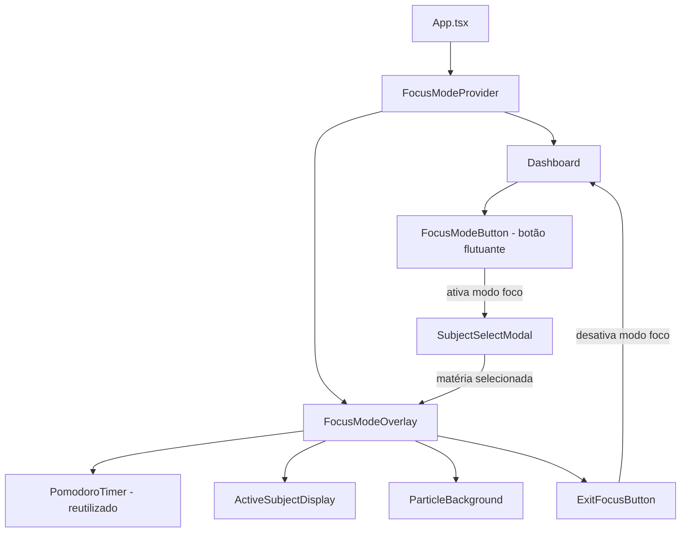
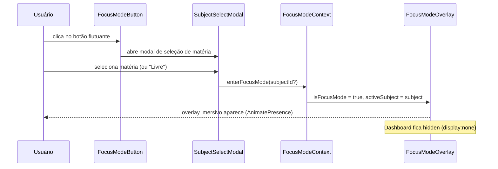
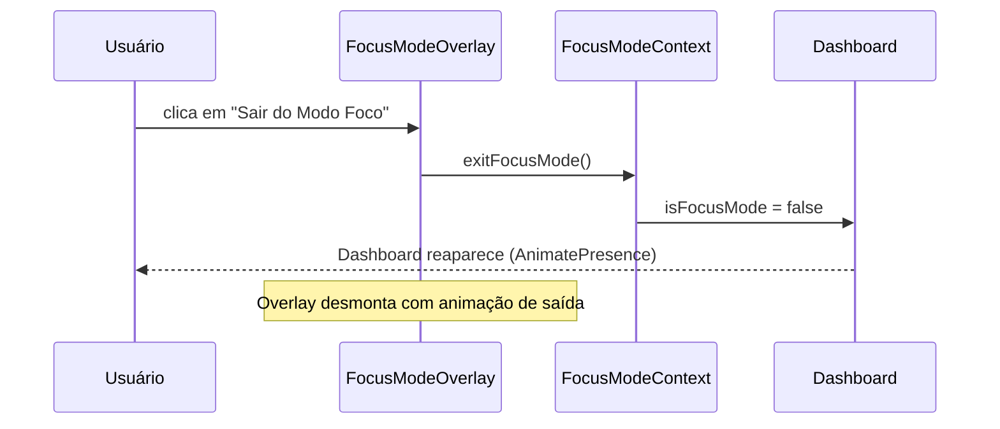

# Design Document: Focus Mode (Modo Foco)

## Overview

O Modo Foco é uma sobreposição imersiva de tela cheia que oculta todo o Dashboard e exibe apenas o timer Pomodoro centralizado, a matéria selecionada e um botão de saída. O objetivo é eliminar distrações visuais e criar um ambiente de estudo concentrado com estética Glassmorphism/Neon consistente com o restante do app.

## Architecture



## Sequence Diagrams

### Ativação do Modo Foco



### Saída do Modo Foco



## Components and Interfaces

### FocusModeContext

**Purpose**: Estado global do modo foco, compartilhado entre App, Dashboard e Overlay.

**Interface**:
```typescript
interface FocusModeState {
  isFocusMode: boolean;
  activeSubjectId: string | null; // null = "Livre" (sem matéria específica)
}

interface FocusModeContextValue extends FocusModeState {
  enterFocusMode: (subjectId?: string) => void;
  exitFocusMode: () => void;
}
```

**Responsibilities**:
- Manter o estado `isFocusMode` e `activeSubjectId`
- Persistir `activeSubjectId` no localStorage via `useLocalStorage`
- Expor `enterFocusMode` e `exitFocusMode` para os componentes filhos

### FocusModeButton

**Purpose**: Botão flutuante fixo na interface que dispara a entrada no modo foco.

**Interface**:
```typescript
interface FocusModeButtonProps {
  subjects: Subject[];
}
```

**Responsibilities**:
- Renderizar botão fixo (posição: fixed, bottom-right ou integrado ao footer)
- Abrir `SubjectSelectModal` ao ser clicado
- Exibir ícone `Focus` do Lucide React com estética neon

### SubjectSelectModal

**Purpose**: Modal para o aluno escolher qual matéria está estudando antes de entrar no modo foco.

**Interface**:
```typescript
interface SubjectSelectModalProps {
  isOpen: boolean;
  subjects: Subject[];
  onConfirm: (subjectId: string | null) => void;
  onCancel: () => void;
}
```

**Responsibilities**:
- Listar todas as matérias disponíveis como opções clicáveis
- Oferecer opção "Livre (sem matéria específica)"
- Confirmar seleção e chamar `onConfirm`
- Fechar sem entrar no modo foco ao cancelar

### FocusModeOverlay

**Purpose**: Sobreposição de tela cheia que substitui visualmente o Dashboard durante o modo foco.

**Interface**:
```typescript
interface FocusModeOverlayProps {
  activeSubject: Subject | null;
  onExit: () => void;
}
```

**Responsibilities**:
- Renderizar fundo imersivo (gradiente animado + partículas)
- Exibir `PomodoroTimer` centralizado (componente existente reutilizado)
- Exibir nome e cor da matéria ativa
- Exibir botão "Sair do Modo Foco"
- Capturar tecla `Escape` para sair

### ParticleBackground

**Purpose**: Fundo animado com partículas flutuantes para o visual imersivo.

**Interface**:
```typescript
interface ParticleBackgroundProps {
  accentColor?: string; // cor da matéria ativa, default: '#818cf8'
}
```

**Responsibilities**:
- Renderizar N partículas com posições e velocidades aleatórias via `useRef`
- Animar com Framer Motion (float up + fade)
- Usar a cor da matéria ativa como accent das partículas

## Data Models

### FocusModeState (localStorage)

```typescript
// Chave: 'focus-mode-last-subject'
type FocusModeLastSubject = string | null; // subjectId ou null
```

**Validation Rules**:
- `activeSubjectId` deve ser um `id` existente em `subjects[]` ou `null`
- Se o id salvo não existir mais em `subjects`, tratar como `null`

## Key Functions with Formal Specifications

### enterFocusMode(subjectId?)

```typescript
function enterFocusMode(subjectId?: string): void
```

**Preconditions:**
- `subjectId` é undefined, null, ou um id válido presente em `subjects[]`

**Postconditions:**
- `isFocusMode === true`
- `activeSubjectId === subjectId ?? null`
- `'focus-mode-last-subject'` no localStorage reflete o novo valor

### exitFocusMode()

```typescript
function exitFocusMode(): void
```

**Preconditions:**
- `isFocusMode === true` (chamada válida apenas quando em modo foco)

**Postconditions:**
- `isFocusMode === false`
- `activeSubjectId` permanece inalterado (memória da última matéria)
- Dashboard volta a ser visível

### resolveActiveSubject(subjectId, subjects)

```typescript
function resolveActiveSubject(
  subjectId: string | null,
  subjects: Subject[]
): Subject | null
```

**Preconditions:**
- `subjects` é um array válido (pode ser vazio)

**Postconditions:**
- Retorna `Subject` se `subjectId` existir em `subjects`
- Retorna `null` se `subjectId` for null ou não encontrado

**Loop Invariants:**
- Todos os elementos verificados antes do índice atual foram comparados com `subjectId`

## Algorithmic Pseudocode

### Algoritmo Principal: Ativação do Modo Foco

```pascal
PROCEDURE enterFocusMode(subjectId: string | undefined)
  INPUT: subjectId — id da matéria selecionada ou undefined
  OUTPUT: atualiza estado global

  SEQUENCE
    resolvedId ← IF subjectId IS NOT undefined THEN subjectId ELSE null
    
    SET state.isFocusMode ← true
    SET state.activeSubjectId ← resolvedId
    
    CALL localStorage.setItem('focus-mode-last-subject', JSON.stringify(resolvedId))
    
    // Bloquear scroll do body para overlay de tela cheia
    SET document.body.style.overflow ← 'hidden'
  END SEQUENCE
END PROCEDURE
```

### Algoritmo: Saída do Modo Foco

```pascal
PROCEDURE exitFocusMode()
  INPUT: nenhum
  OUTPUT: atualiza estado global

  SEQUENCE
    SET state.isFocusMode ← false
    // activeSubjectId mantido para memória da última sessão
    
    // Restaurar scroll do body
    SET document.body.style.overflow ← ''
  END SEQUENCE
END PROCEDURE
```

### Algoritmo: Resolução da Matéria Ativa

```pascal
FUNCTION resolveActiveSubject(subjectId: string | null, subjects: Subject[]): Subject | null
  INPUT: subjectId, subjects
  OUTPUT: Subject ou null

  BEGIN
    IF subjectId IS null THEN
      RETURN null
    END IF

    FOR each subject IN subjects DO
      IF subject.id EQUALS subjectId THEN
        RETURN subject
      END IF
    END FOR

    // id não encontrado (matéria deletada) — fallback seguro
    RETURN null
  END
END FUNCTION
```

## Example Usage

```typescript
// 1. Consumindo o contexto no FocusModeButton
const { enterFocusMode } = useFocusMode();
const handleSelectSubject = (subjectId: string | null) => {
  enterFocusMode(subjectId ?? undefined);
};

// 2. Renderização condicional no App.tsx
const { isFocusMode, activeSubjectId } = useFocusMode();
const activeSubject = resolveActiveSubject(activeSubjectId, subjects);

return (
  <>
    {/* Dashboard oculto mas montado para preservar estado do Pomodoro */}
    <div style={{ display: isFocusMode ? 'none' : 'block' }}>
      <Dashboard />
    </div>

    <AnimatePresence>
      {isFocusMode && (
        <FocusModeOverlay
          activeSubject={activeSubject}
          onExit={exitFocusMode}
        />
      )}
    </AnimatePresence>
  </>
);

// 3. Tecla Escape para sair
useEffect(() => {
  const handleKeyDown = (e: KeyboardEvent) => {
    if (e.key === 'Escape' && isFocusMode) exitFocusMode();
  };
  window.addEventListener('keydown', handleKeyDown);
  return () => window.removeEventListener('keydown', handleKeyDown);
}, [isFocusMode, exitFocusMode]);
```

## Correctness Properties

- Para todo estado onde `isFocusMode === true`, `FocusModeOverlay` está montado e `Dashboard` está com `display: none`
- Para todo estado onde `isFocusMode === false`, `FocusModeOverlay` está desmontado e `Dashboard` está visível
- `PomodoroTimer` nunca é desmontado durante a transição entre modos (preserva estado do timer)
- Se `activeSubjectId` referencia um id que não existe em `subjects[]`, `resolveActiveSubject` retorna `null` sem lançar erro
- `exitFocusMode` chamado quando `isFocusMode === false` é idempotente (não causa efeitos colaterais)

## Error Handling

### Matéria deletada durante o Modo Foco

**Condition**: O usuário deleta uma matéria enquanto está no Modo Foco com aquela matéria ativa.
**Response**: `resolveActiveSubject` retorna `null`; overlay exibe "Estudo Livre" no lugar do nome da matéria.
**Recovery**: Nenhuma ação necessária; o estado é consistente.

### localStorage indisponível

**Condition**: `localStorage` lança exceção ao salvar `activeSubjectId`.
**Response**: `useLocalStorage` já trata `QuotaExceededError` com fallback em memória.
**Recovery**: Estado funciona em memória; ao recarregar, `activeSubjectId` volta a `null`.

### Overlay sem matérias cadastradas

**Condition**: O usuário entra no modo foco sem nenhuma matéria cadastrada.
**Response**: `SubjectSelectModal` exibe apenas a opção "Livre"; `enterFocusMode(undefined)` é chamado.
**Recovery**: Overlay exibe "Estudo Livre" normalmente.

## Testing Strategy

### Unit Testing Approach

- `resolveActiveSubject`: testar com id válido, id inválido, null, array vazio
- `FocusModeContext`: testar `enterFocusMode` e `exitFocusMode` com React Testing Library
- `SubjectSelectModal`: testar renderização das matérias, seleção e cancelamento

### Property-Based Testing Approach

**Property Test Library**: fast-check

- Para qualquer `subjectId` não presente em `subjects[]`, `resolveActiveSubject` sempre retorna `null`
- Para qualquer sequência de `enterFocusMode` / `exitFocusMode`, o estado final é consistente (nunca `isFocusMode === true` com overlay desmontado)

### Integration Testing Approach

- Fluxo completo: clicar no botão → selecionar matéria → verificar overlay → pressionar Escape → verificar Dashboard visível
- Verificar que o `PomodoroTimer` mantém seu estado (tempo decorrido) ao entrar e sair do modo foco

## Performance Considerations

- O `Dashboard` é ocultado via `display: none` (não desmontado) para preservar o estado do `PomodoroTimer` e evitar re-renders custosos ao sair do modo foco.
- `ParticleBackground` usa `useRef` para posições das partículas, evitando re-renders desnecessários.
- Partículas são limitadas a 20-30 elementos para não impactar performance em dispositivos móveis.

## Security Considerations

- Nenhuma dado sensível é armazenado; apenas `subjectId` (string) no localStorage.
- O overlay usa `z-index` alto (9999+) para garantir que nenhum conteúdo externo seja visível.

## Dependencies

- `framer-motion` — animações de entrada/saída do overlay e partículas (já instalado)
- `lucide-react` — ícone `Focus`, `X`, `BookOpen` (já instalado)
- `PomodoroTimer` — componente existente reutilizado sem modificações
- `useLocalStorage` — hook existente para persistir `activeSubjectId`
- `FocusModeContext` — novo contexto React a ser criado em `src/context/FocusModeContext.tsx`
