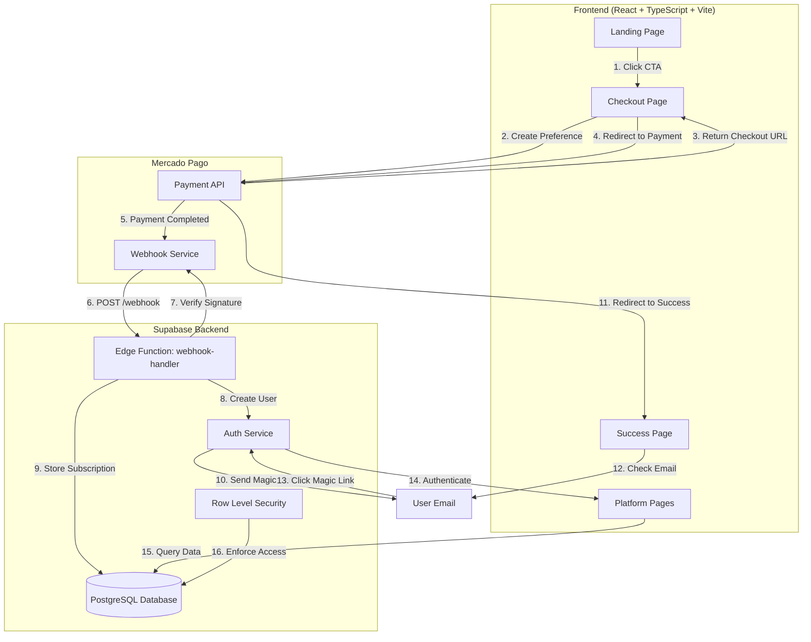

# Design Document: Payment System

## Overview

O sistema de pagamentos automatizado integra um gateway de pagamento (Mercado Pago) com a plataforma de estudos existente (React + TypeScript + Supabase). O fluxo completo permite que usuários acessem uma landing page, realizem o pagamento, tenham suas contas criadas automaticamente no Supabase, e recebam acesso imediato à plataforma. O sistema garante atomicidade entre pagamento confirmado e liberação de acesso, com tratamento robusto de falhas e webhooks para sincronização assíncrona.

A arquitetura utiliza Supabase Edge Functions para processar webhooks do Mercado Pago de forma segura, mantendo credenciais sensíveis no backend. O frontend React gerencia o fluxo de checkout e redirecionamentos, enquanto o Supabase gerencia autenticação, autorização e persistência de dados de assinatura.

## Architecture



## Main Algorithm/Workflow

```mermaid
sequenceDiagram
    participant User
    participant Landing as Landing Page
    participant Checkout as Checkout Page
    participant MP as Mercado Pago API
    participant Webhook as Edge Function
    participant Supabase as Supabase Auth/DB
    participant Success as Success Page
    
    User->>Landing: Visit landing page
    User->>Landing: Click "Assinar Agora"
    Landing->>Checkout: Navigate to /checkout
    
    Note over Checkout: User enters email
    Checkout->>Checkout: Validate email format
    Checkout->>MP: POST /checkout/preferences
    Note over MP: Create payment preference<br/>with email metadata
    MP-->>Checkout: Return preference_id & init_point
    Checkout->>MP: Redirect to init_point
    
    Note over User,MP: User completes payment<br/>on Mercado Pago
    
    MP->>Webhook: POST /webhook (payment.created)
    Webhook->>Webhook: Verify x-signature header
    Webhook->>MP: GET /v1/payments/{id}
    MP-->>Webhook: Return payment details
    
    alt Payment approved
        Webhook->>Supabase: Create user account
        Supabase-->>Webhook: Return user_id
        Webhook->>Supabase: Insert subscription record
        Webhook->>Supabase: Send magic link email
        Webhook-->>MP: 200 OK
        
        MP->>Success: Redirect user to /success
        Success->>User: Display "Check your email"
        
        User->>User: Open email
        User->>Supabase: Click magic link
        Supabase->>Supabase: Authenticate session
        Supabase-->>User: Redirect to /dashboard
    else Payment rejected/pending
        Webhook-->>MP: 200 OK (no action)
        MP->>Success: Redirect to /success?status=pending
        Success->>User: Display "Payment pending"
    end


## Correctness Properties

*A property is a characteristic or behavior that should hold true across all valid executions of a system—essentially, a formal statement about what the system should do. Properties serve as the bridge between human-readable specifications and machine-verifiable correctness guarantees.*

### Property 1: Email Validation

*For any* email string input, the validation function SHALL correctly identify whether it conforms to valid email format, rejecting invalid formats and accepting valid formats.

**Validates: Requirements 2.2, 2.3**

### Property 2: Payment Preference Email Metadata

*For any* valid email address provided during checkout, the created Payment_Preference SHALL include that email in its metadata field.

**Validates: Requirements 2.4, 12.3**

### Property 3: Valid Signature Acceptance

*For any* webhook payload with a valid x-signature header, the Webhook_Handler SHALL accept the request and proceed with payment verification.

**Validates: Requirement 4.1**

### Property 4: Invalid Signature Rejection

*For any* webhook payload with an invalid or missing x-signature header, the Webhook_Handler SHALL reject the request with 401 Unauthorized status.

**Validates: Requirement 4.2**

### Property 5: Approved Payment Status Validation

*For any* payment status value, the Webhook_Handler SHALL only trigger account creation when the status is exactly "approved", ignoring all other status values.

**Validates: Requirement 4.4**

### Property 6: Account Creation Email Mapping

*For any* approved payment with email metadata, the Webhook_Handler SHALL create a user account using that exact email address from the payment metadata.

**Validates: Requirements 5.1, 5.2**

### Property 7: Subscription Record Completeness

*For any* approved payment, the stored subscription record SHALL contain user_id, payment_id, status, and timestamp fields with non-null values.

**Validates: Requirement 5.4**

### Property 8: Subscription Data Persistence

*For any* subscription record created, querying the Subscription_Database by user_id SHALL return a record containing all originally stored fields (user_id, payment_id, status, timestamps).

**Validates: Requirement 8.1**

### Property 9: Automatic Timestamp Generation

*For any* subscription record inserted into the Subscription_Database, the created_at field SHALL be automatically set to the current timestamp without explicit specification.

**Validates: Requirement 8.3**

### Property 10: Subscription Query by User ID

*For any* user_id with an associated subscription, querying the Subscription_Database by that user_id SHALL return the correct subscription record with matching user_id.

**Validates: Requirement 8.4**

### Property 11: Subscription-Based Access Control

*For any* user attempting to access protected data, the Subscription_Database SHALL grant access if and only if the user has an active subscription record, denying access otherwise.

**Validates: Requirements 9.2, 9.3**

### Property 12: Idempotent Webhook Processing

*For any* payment_id, processing multiple webhook notifications with the same payment_id SHALL result in exactly one user account and one subscription record being created, with subsequent requests returning 200 OK without side effects.

**Validates: Requirements 10.1, 10.2**

### Property 13: Error Logging with Context

*For any* error occurring in the Webhook_Handler, the error log SHALL include the payment_id and detailed error information to enable troubleshooting.

**Validates: Requirement 11.1**

### Property 14: User-Facing Error Message Sanitization

*For any* internal error, the error message displayed to users SHALL not expose internal system details, stack traces, or sensitive information.

**Validates: Requirement 11.4**

### Property 15: Payment Preference Configuration Completeness

*For any* Payment_Preference created, it SHALL include product title, description, price, success redirect URL, failure redirect URL, and accepted payment methods.

**Validates: Requirements 12.1, 12.2, 12.4**
