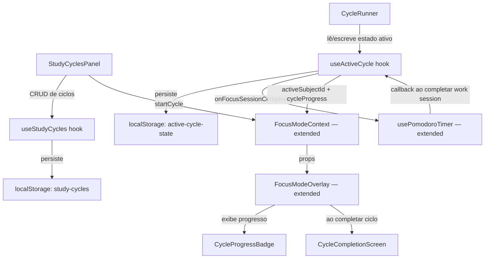
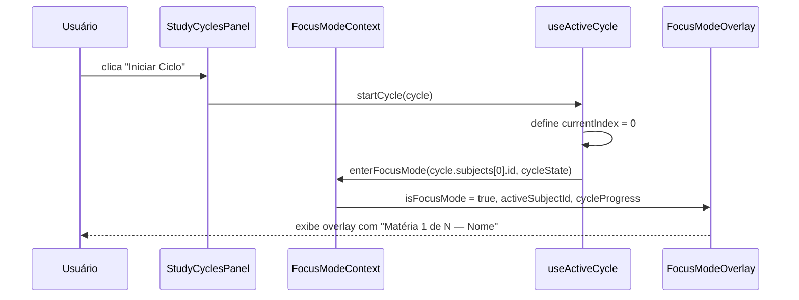
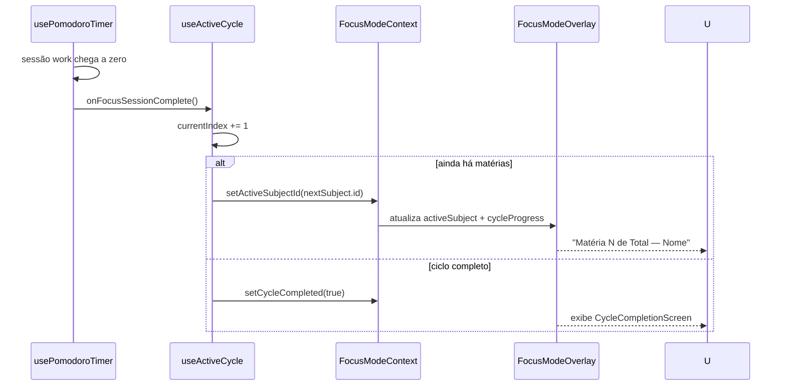

# Design Document: Study Cycles (Ciclos de Estudo)

## Overview

O módulo de Ciclos de Estudo permite ao aluno montar sequências ordenadas de matérias e executá-las em sessões Pomodoro contínuas. Ao iniciar um ciclo, o sistema entra automaticamente no Modo Foco e avança para a próxima matéria a cada sessão de foco concluída, exibindo progresso em tempo real no overlay.

O módulo se integra aos três pilares existentes: `usePomodoroTimer` (fonte de eventos de sessão), `FocusModeContext` (estado global do foco) e `FocusModeOverlay` (UI do overlay).

---

## Architecture



---

## Sequence Diagrams

### Iniciar um Ciclo



### Avançar para Próxima Matéria



---

## Components and Interfaces

### StudyCyclesPanel

**Purpose**: UI principal para criar, listar, editar e iniciar ciclos. Renderizado no Dashboard como seção lazy.

**Interface**:
```typescript
interface StudyCyclesPanelProps {
  subjects: Subject[]
}
```

**Responsibilities**:
- Listar ciclos salvos com nome e matérias
- Abrir modal de criação/edição (`CycleEditorModal`)
- Botão "Iniciar" por ciclo → chama `startCycle`
- Botão "Excluir" por ciclo

---

### CycleEditorModal

**Purpose**: Modal para criar ou editar um ciclo — escolher matérias e ordenar.

**Interface**:
```typescript
interface CycleEditorModalProps {
  isOpen: boolean
  cycle: StudyCycle | null        // null = novo ciclo
  subjects: Subject[]
  onSave: (cycle: StudyCycle) => void
  onClose: () => void
}
```

**Responsibilities**:
- Input de nome do ciclo
- Lista de matérias disponíveis com checkbox de seleção
- Reordenação via botões ↑ / ↓ (sem drag-and-drop obrigatório; drag é enhancement)
- Validação: mínimo 2 matérias, nome não vazio

---

### CycleProgressBadge

**Purpose**: Badge exibido no `FocusModeOverlay` mostrando posição atual no ciclo.

**Interface**:
```typescript
interface CycleProgressBadgeProps {
  currentIndex: number   // 0-based
  total: number
  subjectName: string
  accentColor: string
}
```

**Renders**: `"Matéria 2 de 4 — Biologia"`

---

### CycleCompletionScreen

**Purpose**: Tela exibida dentro do overlay quando todas as matérias do ciclo foram concluídas.

**Interface**:
```typescript
interface CycleCompletionScreenProps {
  cycleName: string
  totalSubjects: number
  onRepeat: () => void
  onExit: () => void
}
```

---

## Data Models

### StudyCycle

```typescript
interface StudyCycle {
  id: string                  // UUID gerado no cliente
  name: string                // Ex: "Ciclo Exatas"
  subjectIds: string[]        // IDs ordenados das matérias
  createdAt: string           // ISO date string
  loop?: boolean              // Se true, reinicia ao completar (padrão: false)
}
```

**Validation Rules**:
- `name`: string não vazia, máx 50 chars
- `subjectIds`: array com mínimo 2 IDs, sem duplicatas
- `id`: gerado via `crypto.randomUUID()` ou fallback `Date.now().toString()`

---

### ActiveCycleState

```typescript
interface ActiveCycleState {
  cycleId: string
  currentIndex: number        // índice atual dentro de subjectIds
  isCompleted: boolean
  startedAt: string           // ISO date string
}
```

**Persisted at**: `localStorage['active-cycle-state']`

---

## Key Functions with Formal Specifications

### startCycle(cycle: StudyCycle): void

```typescript
function startCycle(cycle: StudyCycle): void
```

**Preconditions:**
- `cycle.subjectIds.length >= 2`
- Todos os IDs em `cycle.subjectIds` existem na lista de subjects atual
- Não há ciclo ativo em andamento (ou o usuário confirmou substituição)

**Postconditions:**
- `activeSubjectId === cycle.subjectIds[0]`
- `isFocusMode === true`
- `activeCycleState.currentIndex === 0`
- `activeCycleState.isCompleted === false`

---

### advanceToNextSubject(): void

```typescript
function advanceToNextSubject(): void
```

**Preconditions:**
- `activeCycleState !== null`
- `activeCycleState.isCompleted === false`

**Postconditions:**
- Se `currentIndex + 1 < subjectIds.length`:
  - `currentIndex` incrementado em 1
  - `activeSubjectId` atualizado para `subjectIds[currentIndex]`
- Se `currentIndex + 1 >= subjectIds.length`:
  - Se `cycle.loop === true`: `currentIndex = 0`, reinicia
  - Se `cycle.loop === false`: `isCompleted = true`, `isFocusMode` permanece true (mostra tela de conclusão)

**Loop Invariants:**
- `currentIndex` sempre está no intervalo `[0, subjectIds.length - 1]`
- `activeSubjectId` sempre corresponde a `subjectIds[currentIndex]`

---

### onFocusSessionComplete (callback em usePomodoroTimer)

```typescript
// Adição ao UsePomodoroTimerOptions
interface UsePomodoroTimerOptions {
  onFocusSessionComplete?: () => void
}
```

**Preconditions:**
- `completedMode === 'work'` (só dispara em sessões de foco, não de pausa)

**Postconditions:**
- Callback invocado exatamente uma vez por sessão de foco concluída
- Não afeta o comportamento interno do timer (sem side effects no estado do timer)

---

## Algorithmic Pseudocode

### Algoritmo Principal: Avanço de Ciclo

```typescript
// Executado quando usePomodoroTimer dispara onFocusSessionComplete
function handleFocusSessionComplete(
  activeCycleState: ActiveCycleState,
  cycle: StudyCycle,
  setActiveCycleState: (s: ActiveCycleState) => void,
  setActiveSubjectId: (id: string | null) => void
): void {
  if (activeCycleState === null) return

  const nextIndex = activeCycleState.currentIndex + 1

  if (nextIndex < cycle.subjectIds.length) {
    // Avança para próxima matéria
    const newState: ActiveCycleState = {
      ...activeCycleState,
      currentIndex: nextIndex,
    }
    setActiveCycleState(newState)
    setActiveSubjectId(cycle.subjectIds[nextIndex])
  } else if (cycle.loop) {
    // Reinicia o ciclo
    const newState: ActiveCycleState = {
      ...activeCycleState,
      currentIndex: 0,
    }
    setActiveCycleState(newState)
    setActiveSubjectId(cycle.subjectIds[0])
  } else {
    // Ciclo concluído
    const newState: ActiveCycleState = {
      ...activeCycleState,
      isCompleted: true,
    }
    setActiveCycleState(newState)
    // activeSubjectId permanece o último para manter a cor do overlay
  }
}
```

---

## Extended Interfaces

### FocusModeContext — Extensão

O contexto existente precisa de dois campos adicionais:

```typescript
// Adições ao FocusModeContextValue existente
export interface FocusModeContextValue {
  // --- existentes ---
  isFocusMode: boolean
  activeSubjectId: string | null
  enterFocusMode: (subjectId?: string) => void
  exitFocusMode: () => void
  // --- novos ---
  activeCycleId: string | null
  cycleProgress: CycleProgress | null
  startCycle: (cycle: StudyCycle) => void
  clearCycle: () => void
}

interface CycleProgress {
  currentIndex: number   // 0-based
  total: number
  cycleName: string
  isCompleted: boolean
}
```

**Estratégia de extensão**: Adicionar os novos campos ao `FocusModeProvider` sem quebrar os consumidores existentes (todos os campos novos são opcionais na leitura — `null` quando não há ciclo ativo).

---

## Example Usage

```typescript
// 1. Criar e salvar um ciclo
const cycle: StudyCycle = {
  id: crypto.randomUUID(),
  name: 'Ciclo Exatas',
  subjectIds: ['math-id', 'physics-id', 'chemistry-id'],
  createdAt: new Date().toISOString(),
  loop: false,
}
saveCycle(cycle)

// 2. Iniciar o ciclo (via FocusModeContext)
const { startCycle } = useFocusMode()
startCycle(cycle)
// → entra no Modo Foco com subjects[0], cycleProgress = { currentIndex: 0, total: 3, ... }

// 3. No FocusModeOverlay, exibir progresso
const { cycleProgress, activeSubjectId } = useFocusMode()
if (cycleProgress) {
  // Renderiza CycleProgressBadge
  // "Matéria 1 de 3 — Matemática"
}

// 4. usePomodoroTimer com callback
const timer = usePomodoroTimer({
  onFocusSessionComplete: () => advanceToNextSubject()
})
```

---

## Error Handling

### Matéria removida durante ciclo ativo

**Condition**: O usuário exclui uma matéria que está no ciclo ativo enquanto o Modo Foco está aberto.

**Response**: `advanceToNextSubject` verifica se o `subjectId` ainda existe na lista de subjects. Se não existir, pula para o próximo índice válido.

**Recovery**: Se nenhuma matéria do ciclo existir mais, encerra o ciclo como concluído.

---

### Ciclo com 0 ou 1 matéria

**Condition**: Usuário tenta salvar ciclo com menos de 2 matérias.

**Response**: `CycleEditorModal` exibe mensagem de validação inline e bloqueia o botão "Salvar".

**Recovery**: Usuário adiciona mais matérias antes de salvar.

---

### localStorage indisponível

**Condition**: `localStorage` lança exceção (modo privado restrito, storage cheio).

**Response**: `useStudyCycles` captura o erro no `try/catch` do `useLocalStorage` existente e opera em memória.

**Recovery**: Ciclos não persistem entre reloads, mas a sessão atual funciona normalmente.

---

## Testing Strategy

### Unit Testing

- `advanceToNextSubject`: testar avanço normal, último item sem loop, último item com loop
- `startCycle`: verificar estado inicial correto
- `handleFocusSessionComplete`: todos os branches (avança, loop, completa)
- Validação de `StudyCycle`: nome vazio, menos de 2 matérias, IDs duplicados

### Property-Based Testing

**Property Test Library**: fast-check

**Propriedades**:
- Para qualquer ciclo com N matérias (N ≥ 2), após N chamadas a `advanceToNextSubject` sem loop, `isCompleted === true`
- Para qualquer ciclo com loop, `currentIndex` sempre está em `[0, N-1]` após qualquer número de avanços
- `startCycle` seguido de `clearCycle` sempre resulta em `activeCycleId === null`

### Integration Testing

- Fluxo completo: criar ciclo → iniciar → simular N sessões Pomodoro → verificar conclusão
- `FocusModeOverlay` renderiza `CycleProgressBadge` quando `cycleProgress !== null`
- `FocusModeOverlay` renderiza `CycleCompletionScreen` quando `isCompleted === true`

---

## Performance Considerations

- `useStudyCycles` usa `useLocalStorage` existente — sem overhead adicional
- `CycleProgressBadge` é um componente puramente derivado de props, sem estado interno
- `advanceToNextSubject` é O(1) — apenas incremento de índice e lookup por ID
- Nenhuma operação de rede; tudo client-side

---

## Security Considerations

- Dados persistidos apenas em `localStorage` do próprio usuário — sem exposição externa
- IDs gerados no cliente via `crypto.randomUUID()` — sem colisão previsível
- Nenhum input do usuário é executado como código

---

## Dependencies

- `framer-motion` — animações do overlay e da tela de conclusão (já instalado)
- `lucide-react` — ícones (já instalado): `RefreshCw` (loop), `CheckCircle` (conclusão), `ListOrdered` (ciclos)
- `useLocalStorage` hook existente — persistência de ciclos e estado ativo
- `usePomodoroTimer` — extensão com `onFocusSessionComplete` callback
- `FocusModeContext` — extensão com campos de ciclo
- `Subject` de `studyLogic.ts` — tipo de matéria (sem modificação)
