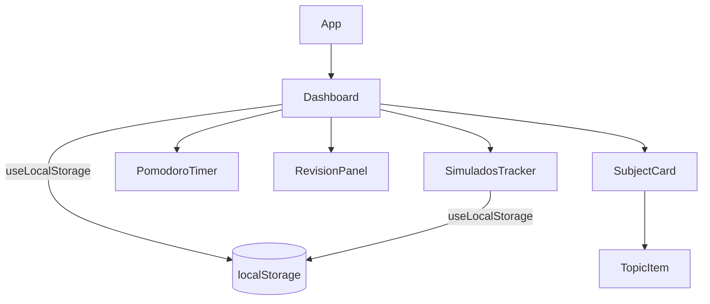
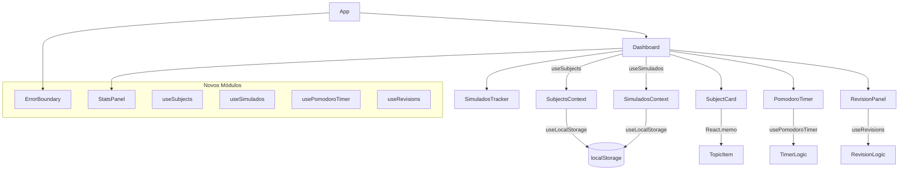
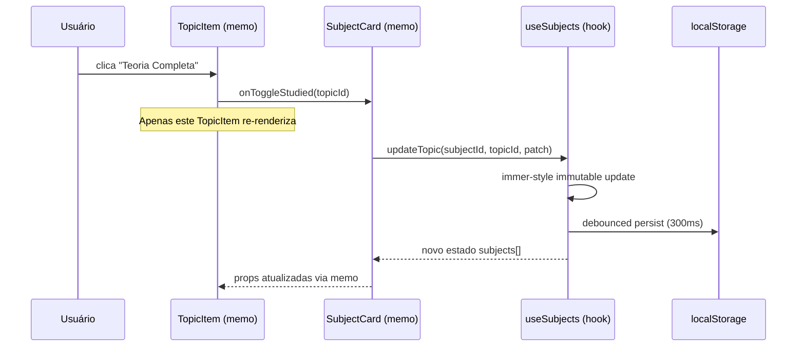
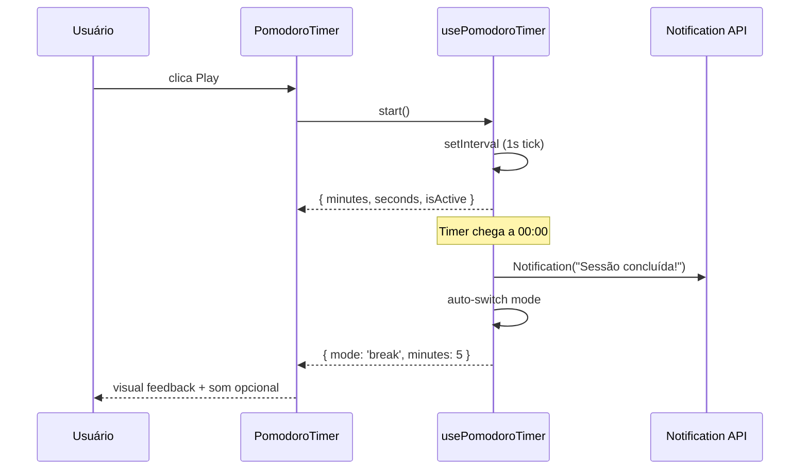
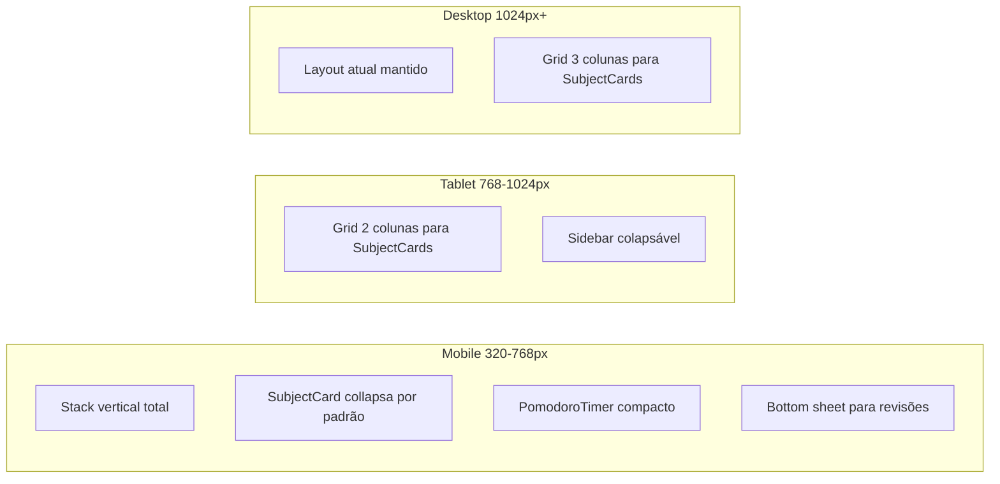

# Design Document: Study Platform Improvements

## Visão Geral

Este documento descreve as melhorias técnicas e de UX/UI para a plataforma de estudos "Foco ENEM" — uma aplicação React + TypeScript + Vite com persistência via `localStorage`. O objetivo é elevar a qualidade do código, a performance percebida e a experiência do usuário, mantendo a identidade visual Glassmorphism/Neon já estabelecida.

As melhorias são organizadas em três eixos principais:
1. **Otimizações de Performance** — redução de re-renders, memoização e lazy loading
2. **Melhorias de UX/UI** — acessibilidade, feedback visual, responsividade mobile e novos fluxos
3. **Refatoração de Arquitetura** — separação de responsabilidades, novos hooks e tipos mais robustos

---

## Arquitetura Atual vs. Proposta

### Estado Atual



### Arquitetura Proposta



---

## Diagrama de Sequência — Fluxo de Atualização de Tópico (Otimizado)



---

## Diagrama de Sequência — Pomodoro com Notificação



---

## Componentes e Interfaces

### 1. `useSubjects` — Hook Centralizado de Matérias

**Propósito**: Extrair toda a lógica de gerenciamento de matérias do `Dashboard`, tornando-o um componente de apresentação.

**Interface**:
```typescript
interface UseSubjectsReturn {
  subjects: Subject[]
  addSubject: (name: string) => void
  updateSubject: (updated: Subject) => void
  deleteSubject: (id: string) => void
  updateTopic: (subjectId: string, topicId: string, patch: Partial<Topic>) => void
  removeTopic: (subjectId: string, topicId: string) => void
  overallProgress: number
  totalTopics: number
  completedTopics: number
}
```

**Responsabilidades**:
- Encapsular `useLocalStorage` para matérias
- Expor funções puras de mutação imutável
- Calcular métricas derivadas com `useMemo`

---

### 2. `useSimulados` — Hook Centralizado de Simulados

**Interface**:
```typescript
interface UseSimuladosReturn {
  simulados: Simulado[]
  addSimulado: (scores: SimuladoScores) => void
  deleteSimulado: (id: string) => void
  averageScore: number
  bestScore: number
  trend: 'up' | 'down' | 'stable'
}
```

---

### 3. `usePomodoroTimer` — Hook Extraído do PomodoroTimer

**Interface**:
```typescript
interface UsePomodoroTimerReturn {
  minutes: number
  seconds: number
  isActive: boolean
  mode: 'work' | 'break'
  sessionsCompleted: number
  start: () => void
  pause: () => void
  reset: () => void
  switchMode: (mode: 'work' | 'break') => void
  formattedTime: string
  progress: number  // 0-100, para anel SVG
}
```

**Responsabilidades**:
- Gerenciar o `setInterval` com `useRef` (evita closure stale)
- Contar sessões completadas
- Solicitar permissão e disparar `Notification API`
- Persistir `sessionsCompleted` no `localStorage`

---

### 4. `useRevisions` — Hook de Revisões

**Interface**:
```typescript
interface ReviewItem {
  topicId: string
  topicName: string
  subjectId: string
  subjectName: string
  subjectColor: string
  reviewDate: string
  daysOverdue: number
}

interface UseRevisionsReturn {
  reviewsDue: ReviewItem[]
  upcomingReviews: ReviewItem[]  // próximos 7 dias
  markReviewed: (topicId: string, subjectId: string) => void
}
```

---

### 5. `StatsPanel` — Novo Componente de Estatísticas

**Propósito**: Painel de métricas consolidadas visível no Dashboard.

**Interface**:
```typescript
interface StatsPanelProps {
  subjects: Subject[]
  simulados: Simulado[]
  pomodoroSessions: number
}
```

**Dados exibidos**:
- Streak de dias estudados (calculado a partir de `completedAt`)
- Horas de foco acumuladas (sessões Pomodoro × 25min)
- Tópicos concluídos esta semana
- Evolução da nota média nos simulados (sparkline)

---

### 6. `ErrorBoundary` — Componente de Tratamento de Erros

**Interface**:
```typescript
interface ErrorBoundaryProps {
  children: React.ReactNode
  fallback?: React.ReactNode
}
```

---

## Modelos de Dados

### `Topic` — Expandido

```typescript
interface Topic {
  id: string
  name: string
  isStudied: boolean
  isExercisesDone: boolean
  completedAt?: string
  reviewDate?: string
  notes?: string
  // NOVO: dificuldade percebida pelo aluno
  difficulty?: 'easy' | 'medium' | 'hard'
  // NOVO: número de revisões realizadas
  reviewCount?: number
  // NOVO: última data de revisão efetiva
  lastReviewedAt?: string
}
```

### `Subject` — Expandido

```typescript
interface Subject {
  id: string
  name: string
  color: string
  topics: Topic[]
  // NOVO: ícone customizável (nome do ícone Lucide)
  icon?: string
  // NOVO: ordem de exibição
  order?: number
  // NOVO: meta de tópicos
  targetTopics?: number
}
```

### `Simulado` — Expandido

```typescript
interface SimuladoScores {
  linguagens: number
  humanas: number
  natureza: number
  matematica: number
  redacao: number
}

interface Simulado {
  id: string
  date: string
  scores: SimuladoScores
  total: number
  // NOVO: nome/identificação do simulado
  label?: string
  // NOVO: notas sobre o simulado
  notes?: string
}
```

### `AppSettings` — Novo

```typescript
interface AppSettings {
  pomodoroWorkMinutes: number    // default: 25
  pomodoroBreakMinutes: number   // default: 5
  reviewIntervalDays: number     // default: 15
  notificationsEnabled: boolean  // default: false
  theme: 'dark'                  // extensível no futuro
  enemDate: string               // default: ENEM_2026_DATE
}
```

---

## Algoritmos com Especificações Formais

### Algoritmo: `calculateSpacedRepetitionDate`

Substituição do intervalo fixo de 15 dias por repetição espaçada adaptativa baseada no número de revisões e dificuldade.

```pascal
ALGORITHM calculateSpacedRepetitionDate(topic, completionDate)
INPUT:
  topic: Topic (com reviewCount e difficulty)
  completionDate: string (ISO date)
OUTPUT:
  nextReviewDate: string (ISO date)

BEGIN
  baseInterval ← 15  // dias

  // Fator de dificuldade
  IF topic.difficulty = 'easy' THEN
    difficultyMultiplier ← 1.5
  ELSE IF topic.difficulty = 'hard' THEN
    difficultyMultiplier ← 0.7
  ELSE
    difficultyMultiplier ← 1.0
  END IF

  // Fator de repetição (quanto mais revisões, maior o intervalo)
  reviewCount ← topic.reviewCount OR 0
  repetitionFactor ← 1.0 + (reviewCount * 0.3)

  // Intervalo final
  interval ← ROUND(baseInterval * difficultyMultiplier * repetitionFactor)
  interval ← MAX(3, MIN(interval, 60))  // clamp entre 3 e 60 dias

  date ← new Date(completionDate)
  date.setDate(date.getDate() + interval)

  RETURN date.toISOString()
END
```

**Pré-condições**:
- `completionDate` é uma string ISO válida
- `topic.reviewCount` é um inteiro não-negativo

**Pós-condições**:
- Retorna uma data futura em relação a `completionDate`
- O intervalo está sempre entre 3 e 60 dias

**Invariante de Loop**: N/A (sem loops)

---

### Algoritmo: `calculateStudyStreak`

```pascal
ALGORITHM calculateStudyStreak(subjects)
INPUT: subjects: Subject[]
OUTPUT: streak: number (dias consecutivos com atividade)

BEGIN
  // Coleta todas as datas de conclusão únicas (por dia)
  allDates ← SET()
  FOR each subject IN subjects DO
    FOR each topic IN subject.topics DO
      IF topic.completedAt IS NOT NULL THEN
        dayKey ← topic.completedAt.substring(0, 10)  // "YYYY-MM-DD"
        allDates.add(dayKey)
      END IF
    END FOR
  END FOR

  IF allDates.isEmpty() THEN
    RETURN 0
  END IF

  sortedDates ← SORT(allDates, descending)
  today ← new Date().toISOString().substring(0, 10)
  yesterday ← subtractDays(today, 1)

  // Streak só conta se hoje ou ontem tiver atividade
  IF sortedDates[0] ≠ today AND sortedDates[0] ≠ yesterday THEN
    RETURN 0
  END IF

  streak ← 1
  current ← sortedDates[0]

  FOR i FROM 1 TO sortedDates.length - 1 DO
    expected ← subtractDays(current, 1)
    IF sortedDates[i] = expected THEN
      streak ← streak + 1
      current ← sortedDates[i]
    ELSE
      BREAK
    END IF
  END FOR

  RETURN streak
END
```

**Pré-condições**:
- `subjects` é um array válido (pode ser vazio)

**Pós-condições**:
- Retorna 0 se não houver atividade recente
- Retorna o número de dias consecutivos com pelo menos um tópico concluído

**Invariante de Loop**: `streak` representa o número de dias consecutivos verificados até o índice `i-1`

---

### Algoritmo: `usePomodoroTimer` — Tick com `useRef`

```pascal
ALGORITHM pomodoroTick(timerRef, state, setState)
INPUT:
  timerRef: React.MutableRefObject<NodeJS.Timeout | null>
  state: { minutes, seconds, isActive, mode, sessionsCompleted }
OUTPUT: side-effects (setState, Notification)

BEGIN
  // Limpa intervalo anterior
  IF timerRef.current IS NOT NULL THEN
    clearInterval(timerRef.current)
  END IF

  IF NOT state.isActive THEN
    RETURN
  END IF

  timerRef.current ← setInterval(() => {
    setState(prev => {
      IF prev.seconds > 0 THEN
        RETURN { ...prev, seconds: prev.seconds - 1 }
      ELSE IF prev.minutes > 0 THEN
        RETURN { ...prev, minutes: prev.minutes - 1, seconds: 59 }
      ELSE
        // Timer chegou a zero
        newMode ← prev.mode = 'work' ? 'break' : 'work'
        newSessions ← prev.mode = 'work'
          ? prev.sessionsCompleted + 1
          : prev.sessionsCompleted

        triggerNotification(prev.mode)  // side-effect controlado

        RETURN {
          ...prev,
          isActive: false,
          mode: newMode,
          minutes: newMode = 'work' ? 25 : 5,
          seconds: 0,
          sessionsCompleted: newSessions
        }
      END IF
    })
  }, 1000)
END
```

**Pré-condições**:
- `state.isActive` é `true` ao entrar no bloco principal
- `timerRef` é um ref mutável válido

**Pós-condições**:
- Apenas um `setInterval` ativo por vez
- Ao chegar a zero, `isActive` é `false` e o modo é alternado

---

## Melhorias de UX/UI

### Responsividade Mobile



### Acessibilidade (a11y)

| Elemento | Melhoria |
|---|---|
| Botões sem texto | Adicionar `aria-label` descritivo |
| Inputs | Associar `<label>` com `htmlFor` |
| Modais/Dropdowns | Gerenciar `focus trap` e `aria-expanded` |
| Cores | Garantir contraste mínimo WCAG AA (4.5:1) |
| Animações | Respeitar `prefers-reduced-motion` |
| Timer | Anunciar mudanças via `aria-live` |

### Feedback Visual Aprimorado

- **Toast notifications** para ações (tópico concluído, simulado salvo, matéria excluída)
- **Confirmação de exclusão** substituir `window.confirm` por modal customizado
- **Estado vazio** com ilustrações e CTAs mais claros
- **Loading skeleton** para hidratação inicial do `localStorage`

---

## Estratégia de Testes

### Testes Unitários

**Biblioteca**: Vitest + React Testing Library

Funções prioritárias para teste:
- `calculateSpacedRepetitionDate` — verificar intervalos por dificuldade e contagem
- `calculateStudyStreak` — verificar streak com datas consecutivas e gaps
- `getProgress` — verificar cálculo com 0, parcial e 100% de tópicos
- `isReviewDue` — verificar com datas passadas, futuras e undefined

### Testes de Propriedade (Property-Based)

**Biblioteca**: fast-check

```typescript
// Propriedade: progresso sempre entre 0 e 100
fc.assert(fc.property(
  fc.array(fc.record({ isStudied: fc.boolean(), isExercisesDone: fc.boolean() })),
  (topics) => {
    const subject = { id: '1', name: 'Test', color: '#fff', topics }
    const progress = getProgress(subject)
    return progress >= 0 && progress <= 100
  }
))

// Propriedade: intervalo de revisão sempre entre 3 e 60 dias
fc.assert(fc.property(
  fc.constantFrom('easy', 'medium', 'hard'),
  fc.integer({ min: 0, max: 20 }),
  (difficulty, reviewCount) => {
    const topic = { ..., difficulty, reviewCount }
    const nextDate = calculateSpacedRepetitionDate(topic, new Date().toISOString())
    const diffDays = daysBetween(new Date(), new Date(nextDate))
    return diffDays >= 3 && diffDays <= 60
  }
))
```

### Testes de Integração

- Fluxo completo: adicionar matéria → adicionar tópico → marcar concluído → verificar revisão agendada
- Persistência: verificar que dados sobrevivem a um "reload" simulado

---

## Considerações de Performance

### Memoização

| Componente/Hook | Otimização |
|---|---|
| `SubjectCard` | `React.memo` com comparação por `subject.id` + `subject.topics.length` |
| `TopicItem` | `React.memo` — re-renderiza apenas quando o próprio `topic` muda |
| `overallProgress` | `useMemo` no `useSubjects` |
| `reviewsDue` | `useMemo` no `useRevisions` |
| Callbacks em `Dashboard` | `useCallback` para `updateSubject`, `deleteSubject` |

### Persistência com Debounce

O `useLocalStorage` atual persiste sincronamente a cada mudança. A melhoria propõe debounce de 300ms para evitar escritas excessivas durante digitação rápida.

```typescript
// useLocalStorage melhorado
useEffect(() => {
  const timer = setTimeout(() => {
    localStorage.setItem(key, JSON.stringify(storedValue))
  }, 300)
  return () => clearTimeout(timer)
}, [key, storedValue])
```

### Lazy Loading

```typescript
// Dashboard.tsx — carregamento lazy de seções pesadas
const SimuladosTracker = lazy(() => import('./SimuladosTracker'))
const StatsPanel = lazy(() => import('./StatsPanel'))
```

---

## Tratamento de Erros

### Cenário 1: localStorage indisponível ou cheio

**Condição**: `localStorage.setItem` lança `QuotaExceededError`
**Resposta**: Capturar no `useLocalStorage`, exibir toast de aviso, manter estado em memória
**Recuperação**: Usuário pode limpar dados via botão de reset nas configurações

### Cenário 2: Dados corrompidos no localStorage

**Condição**: `JSON.parse` falha na inicialização
**Resposta**: Usar `initialValue` como fallback, logar erro no console
**Recuperação**: Dados são sobrescritos na próxima persistência bem-sucedida

### Cenário 3: Erro de renderização em componente filho

**Condição**: Exceção não tratada em `SubjectCard` ou `TopicItem`
**Resposta**: `ErrorBoundary` captura e exibe fallback amigável
**Recuperação**: Botão "Recarregar" no fallback

---

## Dependências

### Existentes (mantidas)
- `react` ^19 + `react-dom`
- `framer-motion` ^12
- `lucide-react` ^1.8
- `typescript` ~6.0
- `vite` ^8 + `@vitejs/plugin-react`
- `tailwindcss` (via classes utilitárias no CSS)

### Novas (propostas)
- `fast-check` — testes de propriedade (devDependency)
- `vitest` — test runner (devDependency)
- `@testing-library/react` — testes de componentes (devDependency)
- `@testing-library/user-event` — simulação de interações (devDependency)

> Nenhuma dependência de runtime nova é necessária. Todas as melhorias de UX (toasts, modais) serão implementadas com componentes próprios usando Framer Motion já existente.

---

## Correctness Properties

*Uma propriedade é uma característica ou comportamento que deve ser verdadeiro em todas as execuções válidas do sistema — essencialmente, uma declaração formal sobre o que o sistema deve fazer. As propriedades servem como ponte entre especificações legíveis por humanos e garantias de corretude verificáveis por máquina.*

### Property 1: Progresso de matéria sempre no intervalo [0, 100]

*Para qualquer* array de tópicos (incluindo vazio, todos concluídos ou nenhum concluído), o valor retornado por `getProgress` deve estar sempre entre 0 e 100 inclusive.

**Validates: Requirements 1.3**

---

### Property 2: Atualização imutável de tópico preserva os demais dados

*Para qualquer* array de matérias e qualquer patch parcial aplicado a um tópico específico, todos os outros tópicos e matérias devem permanecer inalterados após a chamada de `updateTopic`.

**Validates: Requirements 1.4**

---

### Property 3: bestScore é sempre maior ou igual a averageScore

*Para qualquer* array não-vazio de simulados, `bestScore` deve ser sempre maior ou igual a `averageScore`, e `averageScore` deve estar entre o menor e o maior `total` do array.

**Validates: Requirements 2.3**

---

### Property 4: trend sempre retorna um valor do domínio válido

*Para qualquer* array de simulados (incluindo vazio, com 1 elemento ou com N elementos), `trend` deve retornar exatamente um dos três valores: `'up'`, `'down'` ou `'stable'`.

**Validates: Requirements 2.4**

---

### Property 5: total do simulado é sempre a soma exata das áreas

*Para qualquer* conjunto de scores de simulado, o campo `total` calculado por `addSimulado` deve ser exatamente igual à soma aritmética de `linguagens + humanas + natureza + matematica + redacao`.

**Validates: Requirements 2.5**

---

### Property 6: progress do Pomodoro sempre no intervalo [0, 100]

*Para qualquer* estado válido do timer (qualquer combinação de `minutes`, `seconds` e `mode`), o valor de `progress` exposto pelo `usePomodoroTimer` deve estar sempre entre 0 e 100 inclusive.

**Validates: Requirements 3.8**

---

### Property 7: reviewsDue contém exatamente os tópicos com reviewDate vencida

*Para qualquer* conjunto de matérias e tópicos com datas variadas, `reviewsDue` deve conter exatamente os tópicos cuja `reviewDate` é menor ou igual à data atual — nem mais, nem menos.

**Validates: Requirements 4.1**

---

### Property 8: upcomingReviews contém exatamente os tópicos dos próximos 7 dias

*Para qualquer* conjunto de matérias e tópicos, `upcomingReviews` deve conter exatamente os tópicos cuja `reviewDate` está estritamente entre amanhã e 7 dias a partir de hoje — sem sobreposição com `reviewsDue`.

**Validates: Requirements 4.2**

---

### Property 9: markReviewed incrementa reviewCount e define lastReviewedAt

*Para qualquer* tópico com `reviewCount` igual a N, após chamar `markReviewed`, `reviewCount` deve ser N+1 e `lastReviewedAt` deve ser uma string ISO representando a data atual.

**Validates: Requirements 4.3, 4.4**

---

### Property 10: daysOverdue é sempre não-negativo para itens em reviewsDue

*Para qualquer* item presente em `reviewsDue`, o campo `daysOverdue` deve ser sempre um inteiro maior ou igual a zero.

**Validates: Requirements 4.5**

---

### Property 11: calculateSpacedRepetitionDate sempre retorna data futura com intervalo no range [3, 60]

*Para qualquer* combinação válida de `difficulty` (`'easy'`, `'medium'`, `'hard'` ou `undefined`) e `reviewCount` (inteiro não-negativo), a data retornada por `calculateSpacedRepetitionDate` deve ser posterior à `completionDate` e o intervalo em dias deve estar sempre entre 3 e 60 inclusive.

**Validates: Requirements 5.1, 5.6**

---

### Property 12: Ordenação de intervalos por dificuldade é monotônica

*Para qualquer* `reviewCount` fixo, o intervalo calculado para `difficulty = 'easy'` deve ser maior que para `'medium'`, que por sua vez deve ser maior que para `'hard'`.

**Validates: Requirements 5.2, 5.3**

---

### Property 13: Intervalo cresce monotonicamente com reviewCount

*Para qualquer* `difficulty` fixa e qualquer `reviewCount` N ≥ 0, o intervalo calculado para `reviewCount = N+1` deve ser maior ou igual ao intervalo para `reviewCount = N`.

**Validates: Requirements 5.5**

---

### Property 14: calculateStudyStreak sempre retorna inteiro não-negativo

*Para qualquer* array de matérias (incluindo vazio, com tópicos sem `completedAt`, ou com datas não consecutivas), `calculateStudyStreak` deve retornar sempre um inteiro maior ou igual a zero.

**Validates: Requirements 6.1, 6.4**

---

### Property 15: Streak é exatamente o número de dias consecutivos a partir da atividade mais recente

*Para qualquer* conjunto de datas de conclusão com gaps conhecidos, `calculateStudyStreak` deve retornar exatamente o número de dias consecutivos retroativos a partir da data mais recente (hoje ou ontem), parando no primeiro gap.

**Validates: Requirements 6.3, 6.5**

---

### Property 16: Horas de foco exibidas no StatsPanel são sessionsCompleted × 25 minutos

*Para qualquer* valor de `sessionsCompleted` (incluindo zero), as horas de foco exibidas pelo `StatsPanel` devem ser exatamente `sessionsCompleted * 25` minutos convertidos para horas.

**Validates: Requirements 7.2**

---

### Property 17: Campos opcionais ausentes não causam erros em funções que consomem Topic/Subject/Simulado

*Para qualquer* objeto `Topic`, `Subject` ou `Simulado` sem campos opcionais (`difficulty`, `reviewCount`, `lastReviewedAt`, `icon`, `order`, `targetTopics`, `label`, `notes`), todas as funções do sistema que os consomem devem executar sem lançar exceções.

**Validates: Requirements 11.5**

---

### Property 18: Debounce garante no máximo uma escrita no localStorage para N mudanças rápidas

*Para qualquer* sequência de N mudanças de estado ocorrendo em menos de 300ms, o `useLocalStorage` deve realizar exatamente 1 escrita no `localStorage` (após o debounce expirar), não N escritas.

**Validates: Requirements 9.2**
